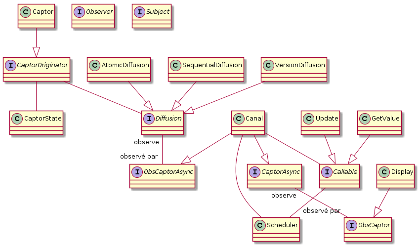

# Projet AOC - Binôme : Garnier Julien, Le Mikaël

## Introduction
Le projet d'AOC consiste à créer un service de diffusion de données de capteurs. Il doit implémenter le patron de conception Active Object ainsi que d'autres patrons de conception si nécessaire.

Le service de diffusion consiste à afficher la valeur d'un capteur sachant que les valeurs sont diffusées, entre le capteur et les afficheurs, de différentes manières possibles. Le projet est codé en Java et les fenêtres sont créées avec Swing.

## Service de Diffusion
Le service contient un capteur qui contient un nombre qui s'incrémente automatiquement. Il est connecté à une méthode de diffusion qui va décider quels nombres vont être affichés à chaque mise à jour du nombre.

Le projet propose 3 méthodes de diffusion différentes : diffusion atomique, diffusion séquentielle et diffusion par version.

La diffusion atomique récupère la valeur créée par le capteur (qui se bloque) et l'envoie ensuite aux afficheurs via les canaux. Les afficheurs vont afficher la nouvelle valeur puis envoyer une réponse à la diffusion pour confirmer la réception. Une fois que tous les afficheurs ont bien reçu la valeur, la diffusion va enfin débloquer le capteur qui va s'incrémenter et donner sa valeur à la diffusion.

La diffusion séquentielle consiste à ne diffuser qu'une sous-séquence de nombres du capteur qui continue de générer des valeurs sans s'arrêter. La diffusion ne stocke aucune valeur, elles sont envoyées et stockées dans les canaux. Cependant, la diffusion n'envoie plus de nouvelle valeur tant que tous les afficheurs n'ont pas reçu la valeur en question. Les afficheurs affichent cette sous-liste dans le même ordre que le capteur.

Pour ces 2 diffusions, les afficheurs doivent rester synchrones, c'est-à-dire qu'ils ne peuvent pas passer à la valeur suivante tant qu'ils n'ont pas tous affiché la valeur courante.

La diffusion par version est semblable à la diffusion atomique dans le fait où les afficheurs vont tous afficher la valeur du capteur mais le capteur est cette fois-ci jamais bloqué et continue à générer des valeurs. Plus aucun mécanisme n'est en place pour assurer la synchronisation i.e. chaque afficheur affiche une valeur qui n'est pas forcement la même que les autres.

## Développement du projet
Le projet a été développé en Java et pour l'affichage de fenêtres en Swing. Le projet contient l'application de plusieurs design patterns, **Active Object**, **Proxy**, **Strategy**, **Observer** et **Memento**. On y retrouve également la notion de moniteur car nous sommes dans une application multithreadée. Nous allons expliquer progressivement l'implémentation des design patterns et éventuellement les motivations qui nous ont poussées à les intégrer au projet.

### Active Object
Le patron Active Object est au coeur de notre application car c'est ce qui était attendu dans le rendu. Son rôle est de découpler l'exécution des méthodes de leurs invocations pour permettre la concurrence et l'invocation de méthodes de manière asynchrone. Dans ce contexte, nous retrouvons donc notre capteur qui génère les valeurs associé à une diffusion. Cette diffusion interagit avec les canaux qui se chargent de notifier puis transmettre la valeur aux afficheurs. Cette transmission est directement liée à un Scheduler pour le découplage de l'invocation et de l'exécution. Une fois que les afficheurs ont bien reçu la notification qu'une nouvelle valeur a été produite, ils demandent aux canaux la valeur du capteur et s'ensuit un fonctionnement similaire à la notification. Un diagramme de classe simpliste de tout ceci nous donne :

### Proxy
Le patron Active Object implique l'utilisation d'un proxy entre le client et le servant qui permet de s'abstraire de la création des fonctions ainsi que des interactions avec le scheduler. Il faut savoir aussi que notre système fonctionne dans un sens comme dans l'autre, donc le servant lors de la notification devient le client dans la récupération de la valeur. Nous avons donc deux proxy, un pour chaque client. Les prendre en compte nous donne ceci :

### Strategy
En parallèle de l'Active Object, nous souhaitons pouvoir changer d'algorithmes lors de la diffusion des valeurs. Nous voulons une diffusion atomique, une diffusion séquentielle et une diffusion par époque. Le patron qui convient est le patron Strategy. Il permet de faire abstraction côté client du type de l'algorithme tout en permettant à l'algorithme d'adapter son exécution selon le client grâce à la méthode configure. Dans notre cas, nous allons juste utiliser la méthode execute. Active Object utilise un patron similaire pour les fonctions à invoquer, quelque chose qui se rapproche du patron Command. Dans notre cas, toutes nos fonctions découlent de l'interface Callable. Les ajouter au diagramme nous donne ceci : 

### Observer
Les interactions entre objets dans notre Active Object se fait via le patron Observer pour permettre une grande flexibilité et pouvoir dynamiquement ajouter de nouveaux afficheurs ou en enlever. Nous avons décidé pour ce faire de créer deux templates, un pour Observer et un pour Subject pour jouer avec la généricité de Java et garder un lien de parenté entre tous les observers et les sujets tout en adaptant les types qu'ils observent, qu'ils renvoient etc.
Si on ajoute toutes nos interfaces, cela nous donne ceci :

Pour plus de lisibilité, nous enlèverons par la suite le lien d'héritage entre les interfaces et les templates Observer et Subject.

### Memento
Jusqu'à l'algorithme de diffusion par période, nous fonctionnions bien sans le patron Memento. Mais l'algorithme par période n'impose aucune synchronisation côté afficheur et permet de recevoir des valeurs antérieures à la valeur courante du capteur. Ceci implique que simplement demander la dernière valeur au capteur ne permet plus de satisfaire tous les algorithmes de diffusion. L'idée a donc été d'utiliser le patron Memento pour préserver ces états dans un objet que la diffusion transmet au proxy qui se charge de mettre le memento dans la fonction d'appel GetValue. L'ajout de ce patron nous donne ceci :

### Choix personnels de conception
Nous avons décidé d'intégrer la notion de Monitor à plusieurs reprises. Tout d'abord, ne sachant pas comment fonctionne le ScheduledExecutorService, nous avons décidé d'ajouter un moniteur pour gérer les accès concurrents à cet objet. Pour ce qui est du capteur, nous avons découpé ce que nous appelons son comportement (mise à jour des valeurs) de son état (valeur actuelle). Nous avons donc un daemon thread CaptorThread qui s'occupe de simuler la mise à jour des valeurs et nous avons un moniteur CaptorMonitor qui se charge des accès concurrents à la valeur critique du capteur. Enfin, l'intégration d'une IHM Swing nous a conduit à ajouter deux interfaces supplémentaires SubjectMonitor et ObsMonitor pour la notification des fenêtres Swing de la mise à jour des moniteurs. Intégrer tous ces choix dans le diagramme de classe donne :

### Exécution et tests
L'exécution du programme nous mène à cette simple fenêtre. Elle permet de choisir l'algorithme utilisé lors de la diffusion avant même l'exécution du programme. 

Ensuite, une fois que nous avons choisi l'algorithme, le bouton Start va exécuter le programme et créer 4 afficheurs et un capteur au même endroit. Il suffit de les glisser les uns à côté des autres. Pour les tests des algorithmes, ils ont été fait selon notre appréciation à défaut de pouvoir écrire des tests. Nous avons pris un screenshot par algorithme qui montre un état que les autres algorithmes ne peuvent avoir (hormis par époque qui peut finalement adopter tous les états avec le hasard). 

Atomique :

Nous voyons bien sur l'image que l'ensemble des fenêtres des afficheurs est synchronisé avec la fenêtre du capteur.

Séquentiel :

Nous voyons bien sur l'image que l'ensemble des fenêtres des afficheurs restent synchronisées entre elles mais ne sont plus désormais synchronisées avec le capteur qui continue de générer des valeurs.

Par époque :

Nous voyons bien sur l'image qu'il n'existe plus aucune synchronisation entre les fenêtres des afficheurs ni même avec le capteur. 
